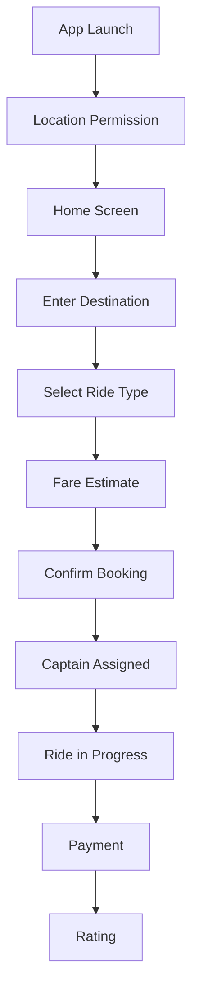
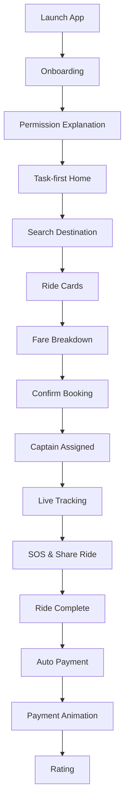

# Enhancing-User-Experience-in-a-Ride-Hailing-Application

# 🚖 Digital Business Systems
# A Study of Rapido's Digital Business Ecosystem

**Course:** Digital Business Systems  
**Topic:** Information Systems, Decision-Making and Strategic Advantage in a Ride-Hailing Application

---

# Table of Contents

* [1. Company Overview](#1-company-overview)
  - [1.1 About Rapido](#11-about-rapido)
  - [1.2 Business Model & Digital Ecosystem](#12-business-model--digital-ecosystem)
  - [1.3 Current Booking Flow](#13-current-booking-flow)
* [2. Current UI/UX Analysis](#2-current-uiux-analysis)
  - [2.1 Visual Design & Branding](#21-visual-design--branding)
  - [2.2 Home Screen & Navigation](#22-home-screen--navigation)
  - [2.3 Booking & Fare Estimation](#23-booking--fare-estimation)
  - [2.4 Payment Experience](#24-payment-experience)
  - [2.5 Live Tracking Screen](#25-live-tracking-screen)
* [3. Identified Flaws & Gaps](#3-identified-flaws--gaps)
  - [3.1 Onboarding](#31-onboarding)
  - [3.2 Home Screen](#32-home-screen)
  - [3.3 Ride Selection](#33-ride-selection)
  - [3.4 Payment](#34-payment)
  - [3.5 Safety](#35-safety)
  - [3.6 Accessibility](#36-accessibility)
  - [3.7 Summary Table](#37-summary-table)
* [4. Proposed UI/UX Improvements](#4-proposed-uiux-improvements)
  - [4.1 Redesigned Onboarding](#41-redesigned-onboarding)
  - [4.2 Home Screen Improvements](#42-home-screen-improvements)
  - [4.3 Transparent Fare Estimation](#43-transparent-fare-estimation)
  - [4.4 Smart Payment Experience](#44-smart-payment-experience)
  - [4.5 Persistent Safety Features](#45-persistent-safety-features)
  - [4.6 Accessibility Enhancements](#46-accessibility-enhancements)
  - [4.7 Improved Booking Flow](#47-improved-booking-flow)
  - [4.8 Before vs After](#48-before-vs-after)
* [5. Conclusion](#5-conclusion)
* [References](#references)

---

# 1. Company Overview

## 1.1 About Rapido

Rapido is India's largest bike taxi aggregator, founded in **2015** by **Aravind Sanka, Pavan Guntupalli, and SR Rishikesh**.

The platform operates in over **100 cities** and has completed more than **250 million rides**.

### Services Offered

* 🏍 Bike Taxi
* 🛺 Auto Booking
* 🚖 Cab Booking
* 📦 Parcel Delivery

Its objective is to provide affordable last-mile transportation by connecting riders with nearby captains through a mobile application.

---

## 1.2 Business Model & Digital Ecosystem

Rapido follows a **platform-based aggregator model**.

### Revenue Sources

* Commission per ride
* Captain subscriptions
* Surge pricing

### Digital Ecosystem

```text
                    RAPIDO ECOSYSTEM

         +------------------------------+
         |      Rapido Rider App        |
         +------------------------------+
                     |
                     |
     -----------------------------------------
     |                                       |
+------------+                     +----------------+
| Captain App|                     | Web Dashboard  |
+------------+                     +----------------+
```

---

## 1.3 Current Booking Flow



---

# 2. Current UI/UX Analysis

## 2.1 Visual Design & Branding

### Strengths

* Strong yellow-black brand identity
* Simple overall interface

### Issues

* Inconsistent typography
* Different button styles
* Weak visual hierarchy

---

## 2.2 Home Screen & Navigation

### Existing Problems

* Too many promotional banners
* Ride history difficult to access
* Saved places not prominent
* Cluttered layout

---

## 2.3 Booking & Fare Estimation

Issues include:

* Horizontal scrolling for ride options
* Dense information
* ETA hidden before booking
* Poor information hierarchy

---

## 2.4 Payment Experience

Current payment options:

* UPI
* Wallet
* Cards
* Cash

Problems:

* Multiple taps required
* No preferred payment memory
* Weak payment confirmation

---

## 2.5 Live Tracking Screen

Current shortcomings:

* Captain details appear too small
* SOS buried inside menus
* Ride sharing difficult to access

---

# 3. Identified Flaws & Gaps

## 3.1 Onboarding

* No onboarding walkthrough
* Sudden permission requests
* Cannot postpone permissions

---

## 3.2 Home Screen

* Promotional overload
* No Recent Places shortcuts
* Poor spacing

---

## 3.3 Ride Selection

* Horizontal scrolling
* Missing fare breakdown
* ETA hidden

---

## 3.4 Payment

* Preferred payment not remembered
* Silent UPI failures
* Weak confirmation feedback

---

## 3.5 Safety

* Hidden SOS button
* No quick ride sharing
* Small captain information

---

## 3.6 Accessibility

Problems include:

* Small fonts
* Low contrast
* No dark mode

---

## 3.7 Summary Table

| Area | Issue | Severity |
|-------|-------|----------|
| Onboarding | No guided tour | Medium |
| Home Screen | Cluttered layout | High |
| Fare Display | No breakdown | High |
| Payment | No payment memory | High |
| Safety | SOS hidden | Critical |
| Accessibility | Small fonts & no dark mode | Medium |

---

# 4. Proposed UI/UX Improvements

## 4.1 Redesigned Onboarding

Introduce a **three-screen onboarding carousel** explaining:

* Ride booking
* Safety
* Payments

Permission requests should include context and be skippable.

---

## 4.2 Home Screen Improvements

Task-first design.

### Layout

```text
---------------------------------------
Destination Search
---------------------------------------

Recent Places

Home • College • Office

-------------------------
         MAP
-------------------------

Bottom Navigation
```

Benefits:

* Less clutter
* Faster booking
* Better focus

---

## 4.3 Transparent Fare Estimation

Replace horizontal scrolling with vertical cards.

Each card includes:

* Fare
* ETA
* Fare breakdown

Example:

```
Bike

₹72

ETA: 3 mins

▼ Fare Breakdown
```

---

## 4.4 Smart Payment Experience

Improvements:

* Preferred payment memory
* Retry failed UPI
* Success animation
* Better confirmation

---

## 4.5 Persistent Safety Features

Introduce:

* Floating SOS button
* One-tap Share Ride
* Larger captain information card

---

## 4.6 Accessibility Enhancements

✔ Minimum 14sp fonts

✔ WCAG AA colour contrast

✔ Dark Mode

✔ Haptic feedback

---

## 4.7 Improved Booking Flow



---

## 4.8 Before vs After

| Current UI | Proposed UI |
|------------|-------------|
| No onboarding | Guided onboarding |
| Cluttered homepage | Task-first layout |
| Horizontal ride list | Vertical cards |
| No fare breakdown | Expandable fare details |
| Hidden SOS | Floating SOS |
| No payment memory | Preferred payment |
| No dark mode | Dark mode |

---

# 5. Conclusion

Rapido has established itself as a leader in India's affordable mobility sector. However, improving its Rider App experience is essential for maintaining competitiveness.

The proposed redesign focuses on:

* Better usability
* Transparent pricing
* Stronger safety
* Accessibility
* Faster ride booking

A task-first interface combined with modern UX principles can improve customer satisfaction, increase ride completion rates, and strengthen long-term user loyalty.

---

# References

1. Rapido (2024) – About Us
2. Nielsen, *Usability Engineering*
3. Don Norman, *The Design of Everyday Things*
4. WCAG 2.1 Guidelines
5. Google Material Design 3
6. Statista Ride-Hailing Reports
7. Interaction Design Foundation
8. Adobe XD Ideas

---
